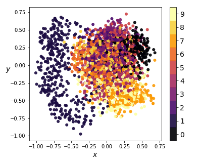
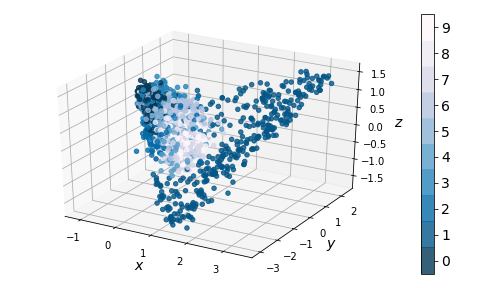

* Table of Contents
{:toc style="float: right;"}

[GitHub Project](https://github.com/mathybit/ml-tutorials){:target="_blank"}

## Introduction

Solving problems using machine learning often involves looking at data with thousands of features.  It is often possible to reduce the number of features, which speeds up training and is also useful for data visualization. One sophisiticated way to do so is using autoencoders.

An *autoencoder* is a type of neural network that can learn efficient representations of data (called *codings*). Any sort of feedforward classifier network can be thought of as doing some kind of representation learning: the early layers encode the features into a lower-dimensional vector, which is then fed to the last layer (this outputs the class probabilities based on the encoding/representation it receives).

The difference with autoencoders is that the training is unsupervised - they are simply learning to reconstruct the inputs. While this sounds trivial, many limiting factors can be introduced, an important one being the dimension of the encoding space (called *latent space*).

|  |
|:--:|
| *Figure 1: A dense autoencoder* |
{:class="table-left" width="50%"}

## Basic architecture

The simplest autoencoder is comprised two neural networks stacked on top of each other: an *encoder*, which compresses the data to a smaller dimensional encoding, followed by a *decoder*, which tries to reconstruct the original data from this encoding.

MNIST is typically used for illustrating how autoencoders work. *Figure 1* shows one possible architecture which uses fully connected layers. Notice the $$784$$-dimensional input (a MNIST image consists of $$28\times28\times1 = 784$$ pixels) is reduced to a $$16$$-dimensional encoding.

The hidden layers 1 and 3 are not necessary. For instance, one can also use a simpler architecture where the only hidden layer is the codings layer. In this case, we can think of the codings as a projection of the input space onto a smaller dimensional subspace of the input space. In fact, if we don't use any nonlinear activations, training will result in the model trying to create codings (projections) that maximize the distance between the projected training instances, essentially performing PCA.

## Implementation

We will use Keras to implement the autoencoder and train it on the MNIST dataset.

### Prepping the data
We can simply import the MNIST dataset directly through Keras.


from keras.datasets import mnist

(X_train, y_train), (X_test, y_test) = mnist.load_data()

height = X_train.shape[1]
width = X_train.shape[2]
channels = 1

X_train = X_train.astype(np.float32) / 255.0 #ensure pixel values are between 0 and 1
X_train = X_train.reshape((X_train.shape[0], height, width, channels))


Notice we normalized our inputs to be between $$0$$ and $$1$$, allowing us to use a $$\mathrm{sigmoid}$$ activation at the output layer of our decoder - this makes evaluating our model's ability to reconstruct the data much simpler (we don't have to rescale output images).

We also reshaped our training set to $$(?, 28, 28, 1)$$ - this approach is convenient as it allows us to easily generalize the code to color images by only changing the `channels` parameter.

### Building the model

We will need the following imports:


from keras import backend as K
from keras.models import Model, Sequential
from keras.layers.core import Activation, Dense, Flatten, Reshape
from keras.optimizers import Adam


We also set the model parameters here, and start with a fresh computation graph:

n_codings = 16

K.clear_session()
n_inputs = height * width * channels # <- predefined earlier 
n_outputs = n_inputs


It is possible to feed the autoencoder flat images (e.g. using `numpy` to flatten/reshape our training set), but instead we incorporate this into the model, which automates things.

First we build the encoder model using `Sequential()`. Notice how in the codings layer, I use the $$\tanh$$ activation function, which restricts the coding values between $$-1$$ and $$1$$, but $$\mathrm{ReLU}$$ or $$\mathrm{sigmoid}$$ work fine too (even no activation works in this case).

encoder = Sequential(name="encoder")

encoder.add(Flatten(input_shape=(height, width, channels, ), name="input"))
encoder.add(Dense(units=250))
encoder.add(Activation('relu'))
encoder.add(Dense(units=n_codings))
encoder.add(Activation('tanh', name='codings'))

encoder.summary()


The decoder is built similarly. It is common practice for the autoencoder to be symmetric, i.e. the encoder and decoder have the same number of hidden units. Here we use an asymmetric design with a more powerful decoder.

decoder = Sequential(name="decoder")

decoder.add(Dense(units=320, input_shape=(n_codings,), name='codings_in'))
decoder.add(Activation('relu'))
decoder.add(Dense(units=n_outputs))
decoder.add(Activation('sigmoid'))
decoder.add(Reshape(target_shape=(height,width,channels), name='output'))

decoder.summary()


Finally, we stack the two networks together to create the autoencoder:

model = Sequential()
model.add(encoder)
model.add(decoder)
model.summary()


This could have all been done in a single sequential model, but building the encoder and decoder separately allows us to analyze our model in detail later on (and perform tasks like digit generation).

### Training the model

Keras makes training very straightforward. First we choose an optimizer and compile the model. Adam works pretty well and seems to converge faster than SGD for this model.

optimizer = Adam()

encoder.compile(loss='mean_squared_error', optimizer="adam")
decoder.compile(loss='mean_squared_error', optimizer="adam")
model.compile(loss='mean_squared_error', optimizer=optimizer)


For the actual training, we only needed to compile the `model` object. However, if we want to use the encoder and decoder later on without issues, it's necessary compile both separately in addition to compiling the stacked model. The choice of loss function for the `encoder` and `decoder` is irrelevant, as we never actually train these separately.

Finally, we train our model for 50 epochs with a batch size of 200:

epochs = 50
batch_size = 200

history = model.fit(
    X_train, X_train, batch_size=batch_size, epochs=epochs, verbose=1
)

score = model.evaluate(X_test, X_test, verbose=1)
print("Test score:", score)


The *mean squared error* (MSE) loss is defined as the average squared Euclidean norm
\$$
MSE = \dfrac{1}{m} \sum_{i = 1}^m \| X_i - \hat{X_i} \|^2
\$$
where $$\{X_1, X_2, \dots, X_m\}$$ is a mini-batch of training images, $$X_i$$ is an input image, and $$\hat{X_i}$$ is the reconstruction output from our model. 

|  |
|:--:|
| *Figure 2: Reconstruction progress* |
{:class="table-left"}

It performs well for measuring the error in image reconstruction, starting at about $$0.07$$ and decreasing to about $$0.01$$ over the 50 epochs. *Figure 2* illustrates how the model improved its ability to compress and reconstruct images during training.

## Generating digits

While not a good performer, our decoder can be used to generate digits. We do so by feeding a random vector of codings into the model and looking at the output:

n_images = 36

codings_in = np.random.normal(0, 0.33, n_images * n_codings).reshape((n_images, n_codings))
images_out = decoder.predict(codings_in)


|  |
|:--:|
| *Figure 3: Generating digits* |
{:class="table-left"}

Here we sample from a normal distribution with $$\mu = 0$$ and $$\sigma = 0.33$$, to ensure most of the values lie between $$-1$$ and $$1$$ (just like our codings). 

Some of the output images resemble handwritten digits.

## Coding space

It is rare for regular autoencoders to be able to generate data that resembles the training set. Why is this the case? Let's analyze the coding space. *Figure 4* shows histograms for a few coordinates of the encoded training set:

|  |
|:--:|
| *Figure 4: Encoding coordinate distributions* |
{:class="table-center" width="80%"}

The distributions of the encoded coordinates are quite different different. It's no surprise that feeding in normally distributed encodings doesn't produce high quality images. 

| {:width="100%"} |
|:--:|
| *Figure 5: KernelPCA on encodings (2-dim)* |
{:class="table-left"}

We compress the codings further using $$2$$-dimensional KernelPCA on a random sample of 3000 training instances, and obtain the results in *Figure 5*. Notice how, for the most part, encodings of images with distinct images have significant overlap. This means that part of the latent space resembles a smooth manifold, which explains why the generated images in *Figure 3* didn't look too bad.

However, the projections of digit $$1$$ codings form a cluster separated from the rest, resulting in a coding space that is non-convex. This explains why none of the randomly generated images look like $$1$$'s - there is no smooth interpolation between the cluster of $$1$$'s and the rest of the coding space. Furthermore, since our codings are forced between $$-1$$ and $$1$$ by our $$\tanh$$ activation, any coding values outside that interval will likely result in distorted and unrecognizable images.

This clustering issue becomes even more apparent in 3D:

| {:width="100%"} |
|:--:|
| *Figure 6: KernelPCA on encodings (3-dim)* |
{:class="table-center"}

## Convolutional autoencoders

One way to modify our dense autoencoder is to use convolutional layers. This is especially common for image data. *Figure 7* shows a hybrid between a purely convolutional autoencoder, with added fully-connected layers which make the model more powerful.

| {:width="90%"} |
|:--:|
| *Figure 7: Convolutional autoencoder architecture* |
{:class="table-center"}

### Implementation

We will need a few additional imports:

from keras.layers.convolutional import Conv2D, UpSampling2D, MaxPooling2D


As before, we start with the encoder model. For image downsizing, we use `MaxPooling2D` with a $$(2,2)$$ kernel, but `AveragePooling2D` is a viable alternative. 

K.clear_session()
n_codings = 16

encoder = Sequential(name="encoder")

encoder.add(Conv2D(input_shape=(height,width,channels),
                   filters=4, kernel_size=5, strides=1, padding='same'))
encoder.add(Activation('relu'))
encoder.add(MaxPooling2D(pool_size=(2, 2)))

encoder.add(Conv2D(filters=8, kernel_size=5, strides=1, padding='same'))
encoder.add(Activation('relu'))
encoder.add(MaxPooling2D(pool_size=(2, 2)))

encoder.add(Flatten())

encoder.add(Dense(units=150))
encoder.add(Activation('relu'))

encoder.add(Dense(units=n_codings))
encoder.add(Activation('tanh', name='output'))

encoder.summary()


Next is the decoder model. For increasing image resolution, it is also possible to use `Conv2DTranspose` instead of stacking `UpSampling2D` and `Conv2D` layers.

decoder = Sequential(name="decoder")

decoder.add(Dense(input_shape=(n_codings, ), units=120, name='codings_in'))
decoder.add(Activation('relu'))
decoder.add(Dense(units=320))
decoder.add(Activation('relu'))

h0 = encoder.layers[-6].output_shape[1]
w0 = encoder.layers[-6].output_shape[2]
feats = 16
decoder.add(Dense(units=h0*w0*feats))
decoder.add(Activation('relu'))
decoder.add(Reshape(target_shape=(h0, w0, feats,)))

decoder.add(UpSampling2D(size=(2,2)))
decoder.add(Conv2D(filters=8, kernel_size=5, strides=1, padding='same'))
decoder.add(Activation('relu'))

decoder.add(UpSampling2D(size=(2,2)))
decoder.add(Conv2D(filters=4, kernel_size=6, strides=1, padding='same'))
decoder.add(Activation('relu'))

decoder.add(Conv2D(filters=1, kernel_size=7, strides=1, padding='same'))
decoder.add(Activation('sigmoid', name='output'))

decoder.summary()


Finally, we stack the two together, choose our optimizer, and compile the models just like before.

model = Sequential()
model.add(encoder)
model.add(decoder)
model.summary()

optimizer = Adam()

encoder.compile(loss='mean_squared_error', optimizer="adam")
decoder.compile(loss='mean_squared_error', optimizer="adam")
model.compile(loss='mean_squared_error', optimizer=optimizer)


### Performance

| {:width="90%"} |
|:--:|
| *Figure 8: Reconstruction progress* |
{:class="table-left"}

During training, the convolutional model learns significantly faster, with reconstructions looking good after 10 epochs. The gif in *Figure 8* shows reconstruction progress while training for only 5 epochs.

However, it is not perfect. Notice the digit 9 is reconstructed as a 7. Some fine-tuning is needed to improve performance here (such as modifying the kernel sizes for the convolutional layers, or adding extra filters to allow the model to learn finer details).

The model performs worse than our dense autoencoder for digit generation:

|  |
|:--:|
| *Figure 9: Generating digits* |
{:class="table-center"}

Performing KernelPCA reveals the same clustering issue that our dense autoencoder suffered from:

| {:width="100%"} |
|:--:|
| *Figure 10: KernelPCA on encodings (3-dim)* |
{:class="table-center"}

## Remarks

Both the dense and convolutional autoencoder models gave good reconstructive performance. However, using them as generative models didn't consistently yield images that could pass as digits written by a human. The issue arose from the topology of the latent space. 

*Variational autoencoders* solve the clustering problem by forcing codings to follow a smooth target distribution (usually the standard normal), resulting in a smoother latent space, with less clusters. We will discuss these in a future article.

The [autoencoders.ipynb](https://github.com/mathybit/ml-tutorials/blob/master/autoencoders.ipynb){:target="_blank"} notebook contains all the code used to generate the visuals in this article.
