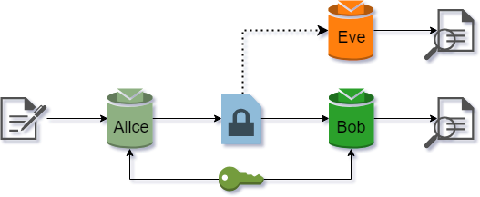

* Table of Contents
{:toc style="float: right;"}

[GitHub Project](https://github.com/mathybit/ml-tutorials){:target="_blank"}

## Introduction

In 2016, researchers from Google Brain published a paper showing how neural networks can learn symmetric encryption to protect information from AI attackers. In this article, we use Keras to implement the neural networks described in *[Learning to Protect Communications with Adversarial Neural Cryptography](../assets/docs/csai/Google_adv_neural_crypto.pdf){:target="_blank"}*.

We also provide a second implementation, and some proof-of-concept code that can allow a user to use the encryption scheme learned by neural networks through adversarial training.

## Basic setup (symmetric)

Suppose Alice and Bob want to communicate securely over a public channel, and Eve is an attacker eavesdropping on the communication. For symmetric encryption, we may assume Alice and Bob both have a common secret key. Eve is able to capture all the encrypted messages Alice sends to Bob, but does not have access to the secret key. This scenario is depicted in *Figure 1*.

|  |
|:--:|
| *Figure 1: Symmetric encryption setup* |
{:class="table-center" width="50%"}

## Implementation

To implement this scenario, we build 3 neural networks:
* Alice is the encryption algorithm.
* Bob is the decryption algorithm
* Eve is the attacker

To implement this in Keras, we need the following imports:


from keras import backend as K
from keras.models import Model
from keras.engine.input_layer import Input
from keras.layers.core import Activation, Dense
from keras.layers import Flatten, Reshape
from keras.layers.convolutional import Conv1D
from keras.layers.merge import concatenate
from keras.optimizers import Adam, RMSprop


We also set up the model parameters. As per the research paper, we will use 16-bit messages and secret keys, and 16-dim ciphertexts.


# Set up the crypto parameters: message, key, and ciphertext bit lengths
m_bits = 16
k_bits = 16
c_bits = 16
pad = 'same'

# Compute the size of the message space, used later in training
m_train = 2**(m_bits) #+ k_bits)


### Alice/Bob net

The Alice network will need to have two input vectors: the message to be encrypted, and the secret key. These get concatenated along `axis=1` and fed to a dense layer. The signal then passes through a sequence of four Conv1D layers to create the output.


ainput0 = Input(shape=(m_bits,)) #message
ainput1 = Input(shape=(k_bits,)) #key
ainput = concatenate([ainput0, ainput1], axis=1)

adense1 = Dense(units=(m_bits + k_bits))(ainput)
adense1a = Activation('tanh')(adense1)
areshape = Reshape((m_bits + k_bits, 1,))(adense1a)

aconv1 = Conv1D(filters=2, kernel_size=4, strides=1, padding=pad)(areshape)
aconv1a = Activation('tanh')(aconv1)
aconv2 = Conv1D(filters=4, kernel_size=2, strides=2, padding=pad)(aconv1a)
aconv2a = Activation('tanh')(aconv2)
aconv3 = Conv1D(filters=4, kernel_size=1, strides=1, padding=pad)(aconv2a)
aconv3a = Activation('tanh')(aconv3)
aconv4 = Conv1D(filters=1, kernel_size=1, strides=1, padding=pad)(aconv3a)
aconv4a = Activation('sigmoid')(aconv4)

aoutput = Flatten()(aconv4a)

alice = Model([ainput0, ainput1], aoutput, name='alice')


Note that the output of the Dense layer will be 2-dimensional, with the mini-batch instances along the first axis. This needs to be reshaped to `(batch_size, m_bits + k_bits, 1)` before being fed to a Conv1D layer, introducing a third dimension which would normally correspond to the number of channels (in this case there is only 1).

The architecture for the Bob network is identical to Alice's, except `input0` now represents the ciphertext instead of the plaintext.

### Eve net

As per the specifications in the research paper, the Eve network will have TWO dense layers acting on the inputs. The idea is to give it a better chance at decrypting the message, since it doesn't have access to the secret key - it only sees the ciphertext.


einput = Input(shape=(c_bits,)) #ciphertext only

edense1 = Dense(units=(c_bits + k_bits))(einput)
edense1a = Activation('tanh')(edense1)
edense2 = Dense(units=(c_bits + k_bits))(edense1a)
edense2a = Activation('tanh')(edense2)
ereshape = Reshape((c_bits + k_bits, 1,))(edense2a)

econv1 = Conv1D(filters=2, kernel_size=4, strides=1, padding=pad)(ereshape)
econv1a = Activation('tanh')(econv1)
econv2 = Conv1D(filters=4, kernel_size=2, strides=2, padding=pad)(econv1a)
econv2a = Activation('tanh')(econv2)
econv3 = Conv1D(filters=4, kernel_size=1, strides=1, padding=pad)(econv2a)
econv3a = Activation('tanh')(econv3)
econv4 = Conv1D(filters=1, kernel_size=1, strides=1, padding=pad)(econv3a)
econv4a = Activation('sigmoid')(econv4)

eoutput = Flatten()(econv4a)# Eve's attempt at guessing the plaintext

eve = Model(einput, eoutput, name='eve')


### Loss and optimizer

In order to train the networks, we first need link them according to *Figure 1*.


aliceout = alice([ainput0, ainput1])
bobout = bob( [aliceout, binput1] )# bob sees ciphertext AND key
eveout = eve( aliceout )# eve doesn't see the key


The loss for Eve is just the L1 distance between `ainput0` and `eoutput`:


eveloss = K.mean(  K.sum(K.abs(ainput0 - eveout), axis=-1)  )


Instead of doing an average, sum is taken over all the bits in the message - this is the *per-example* loss talked about in the original paper, and its value represents the avg number of bits Eve guesses incorrectly. We then take the average across the entire mini-batch with `K.mean()`. The minimum value of the loss is 0 (Eve guesses all the bits correctly), while the maximum is 16 (Eve is wrong about all the bits, in which case we flip the prediction and recover the message). 

The loss for Alice-Bob is slightly more complicated. First, we want Bob to successfully decrypt the ciphertext:


bobloss = K.mean(  K.sum(K.abs(ainput0 - bobout), axis=-1)  )


Would also like Alice to learn an encryption scheme which Eve can't break. In an ideal situation, Eve should do no better than random guessing, in which case she would correctly guess half the bits, or `m_bits/2` correctly (corresponding to a loss value of 8).


K.square(m_bits/2 - eveloss)/( (m_bits//2)**2 )


The square term ensures the error grows large when Eve starts to guess a few of the bits correctly. This forces Alice to adapt more rapidly to attackers, and change its encryption scheme. Overall the Alice-Bob loss will be:


abeloss = bobloss + K.square(m_bits/2 - eveloss)/( (m_bits//2)**2 )


As per the optimizer, we use RMSprop with a default learning rate of 0.001:


abeoptim = RMSprop(lr=0.001)
eveoptim = RMSprop(lr=0.001) #default 0.001


Finally, we create two training models with the custom loss functions defined earlier:


# Build and compile the ABE model, used for training Alice-Bob networks
#
abemodel = Model([ainput0, ainput1, binput1], bobout, name='abemodel')
abemodel.add_loss(abeloss)
abemodel.compile(optimizer=abeoptim)

# Build and compile the Eve model, used for training Eve net (with Alice frozen)
#
alice.trainable = False
evemodel = Model([ainput0, ainput1], eveout, name='evemodel')
evemodel.add_loss(eveloss)
evemodel.compile(optimizer=eveoptim)


## Training

The research paper suggests to train the Alice-Bob stack first, followed by 2 cycles of training the Eve network. We build a custom training script to achieve this (note that the [Jupyter notebook on GitHub](https://github.com/mathybit/ml-tutorials){:target="_blank"} contains more code for nice output during training).


n_epochs = 20
batch_size = 512
n_batches = m_train // batch_size
abecycles = 1
evecycles = 2

epoch = 0
while epoch < n_epochs:
    for iteration in range(n_batches):
        # Train the A-B+E network
        #
        alice.trainable = True
        for cycle in range(abecycles):
            # Select a random batch of messages, and a random batch of keys
            #
            m_batch = np.random.randint(0, 2, m_bits * batch_size).reshape(batch_size, m_bits)
            k_batch = np.random.randint(0, 2, k_bits * batch_size).reshape(batch_size, k_bits)
            abemodel.train_on_batch([m_batch, k_batch, k_batch], None)
        
        # Train the EVE network
        #
        alice.trainable = False
        for cycle in range(evecycles):
            m_batch = np.random.randint(0, 2, m_bits * batch_size).reshape(batch_size, m_bits)
            k_batch = np.random.randint(0, 2, k_bits * batch_size).reshape(batch_size, k_bits)
            evemodel.train_on_batch([m_batch, k_batch], None)
    
    epoch += 1
	
print('Training finished.')


## Results

During training, we kept track of not only the `abeloss` and `eveloss` values, but we also evaluated Bob's ability to decrypt messages sent by Alice. *Figure 2* shows the loss values as training progressed.

|  |
|:--:|
| *Figure 2: Loss values during training* |
{:class="table-center" width="80%"}

Initially, all 3 loss values start at 8, which means neither Eve nor Bob do any better than random guessing. Eve's loss decreases faster up to a point, after which Alice is able to learn an encryption scheme which Bob is able to decrypt, but which Eve can no longer decipher. Notice that Eve's loss doesn't climb back up to 8, so Eve still does slightly better than random guessing.

We evaluated Bob and Eve on 10,000 random messages (encrypted with randomly selected keys), and found the following:


Bob % correct:  89.28 %
Eve % correct:  0.21 %


Bob is able to successfully decrypt a little under 90% of the messages he receives, while *Eve cannot recover the full message in its current state*. However, if we were to freeze the Alice-Bob model, and continue to train Eve, her performance would improve.

It's important to realize that Eve still performs better than random guessing. For each bit, a purely random guess would have
\$$
P(\text{1 bit correct}) = \frac{1}{2}
\$$

chance of guessing that bit correctly. Under the assumption of independent bits in the ciphertext, the probability of guessing the entire message correctly would be
\$$
P(\text{all bits correct}) = \pr{\frac{1}{2}}^{16} = 0.0015 \%
\$$
which is much worse than Eve's actual performance.

It is interesting to analyze the performance of Eve when keeping Alice-Bob frozen. *Figure 3* shows two such scenarios:

| {:width="50%" class="image-right"} {:width="50%"} |
|:--:|
| *Figure 3: Eve's performance for frozen A-B when starting untrained (left) or trained (right)* |
{:class="table-center"}

When starting with freshly initialized networks, and keeping Alice-Bob frozen, Eve is still able to gain a non-negligible advantage. She ends up with 3 incorrectly guessed bits on average. When evaluated on a sample of 10,000 ciphertexts, we get


Bob % correct:  0.0 %
Eve % correct:  2.55 %


However, when keeping the trained version of Alice-Bob constant, we see that Eve's advantage doesn't begin to improve. The loss stays roughly constant, which suggests the encryption algorithm learned by Alice may not need to be continually improved.

## AI-based encryption (PoC)

We built and trained similar neural configuration on 8-bit messages/keys and 8-dimensional ciphertexts. Other than the bit size, we also added a dense layer after the sequence of Conv1D layers, and allowed the codings to be between $$-1$$ and $$1$$ by using the $$tanh()$$ activation function at output. *Figure 4* shows the training loss of our setup.

| {:width="50%" class="image-right"} {:width="50%"} |
|:--:|
| *Figure 4: Training progress for 2000 iterations (left) and overall (right)* |
{:class="table-center"}

The resulting performance of Bob and Eve when evaluated on a sample of 10,000 ciphertexts was:

Bob % correct:  99.99 %
Eve % correct:  2.3 %


The high level of accuracy by the decryption algorithm makes this a good model to build a toy-model cryptosystem that can operate on human-readable characters. To this end, one could use 8-bit ASCII character encodings, and convert them to binary arrays that can be fed into the Alice model.

Instead we limited ourselves to lowercase letters and a few punctuation marks by using a 5-bit binary encoding. We pad this with 3 random bits, resulting in an 8-bit binary encoding that can be fed to the Alice model (this also makes our encryption probabilistic).

The fact that our encodings are 32-bit floating point numbers means there's no nice way to convert the ciphertext to something human-readable. To get around this, we convert each coordinate of the 8-dim encoding into a 32-bit binary string, and concatenate them together to get a binary encoding. This means that each human-readable character goes from an 8-bit padded binary representation to a $$32 \cdot 8 = 256$$-bit ciphertext representation. For example, the plaintext *"adi"* has (one of many) binary representation


000000000000001100101000


but its ciphertext encoding is much, much worse. Mapped to human-readable output via the 5-bit map, it looks like


?pfx?bhj?t,z!!ma!nhr:exs!qlt,apl:id?.j..?eu??lzr?yjg:lfo!bun?j?l?qfl?uuo?usb!ztg?uqh:mte?vuq? j 


Bob is able to successfully decode the binary ciphertext, while Eve's code-breaking attempt results in:

!??


While somewhat wasteful memory-wise, this is just a PoC. There are various other options to create a robust cryptosystem using the trained Alice and Bob models. We leave it to the reader to use our code as a starting point, and modify it as they see fit to design their own AI-based encryption scheme.
