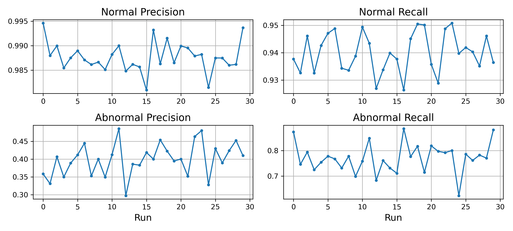
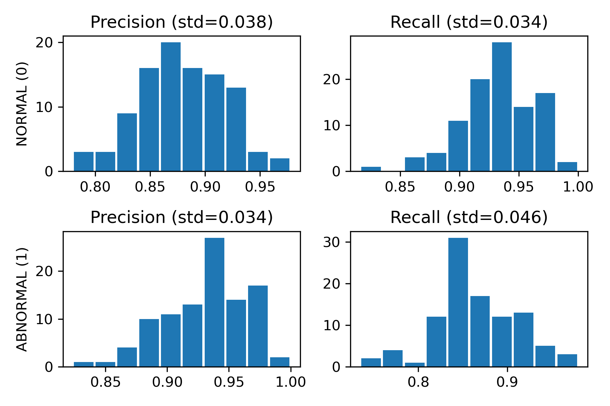

* Table of Contents
{:toc style="float: right;"}

[GitHub Project](https://github.com/mathybit/ml-tutorials){:target="_blank"}

## Introduction

When evaluating a machine learning model, most practitioners simply apply the standard precision/recall 
formulas to whatever test set they have. The results can be wildly misleading when these metrics are computed on
imbalanced test sets. Here's how to see past the noise.

It is well known that class imbalance during model training can severely degrade performance, and there are many 
techniques to address it (sampling-based, fancy loss functions, synthetic data, etc.). But how does one deal with
evaluating a model on unbalanced data, especially in continuous monitoring settings where the performance is
calculated on fresh data over time to decide whether the model needs retraining? Even a modest imbalance in
the test data can throw off performance estimates enough to trigger unnecessary (and costly) retraining cycles.

To demonstrate this, I simulate a binary classification scenario (specifically: anomaly detection). The key insight 
is straightforward: **two models with identical true performance can produce very different precision and recall values 
depending on the class distribution in the test set**.

Ideally, performance monitoring should be performed on test sets with identical class distributions, but this is 
rarely possible in practice. I propose a simple no-cost solution that easily cuts through this noise.

## Experiment setup

The following setup simulates a binary classification problem with two classes: class 0 is the *normal* (majority) class and class 1 is the *abnormal* (minority, anomalous) class.

### Model and data

To represent an incoming data point, we define a simple `AbstractPoint` with a `label` (integer) and a `drift` parameter (a float between 0 and 1 that captures how difficult the point is to predict):


class AbstractPoint(dict):
    def __init__(self, label: int, drift: float):
        dict.__init__(self, label=label, drift=max(0.0, min(1.0, drift)))
        self.label = label
        self.drift = drift


We also define an `AbstractModel`, which holds the per-class recall rates and uses them to determine whether each incoming point is classified correctly.

The model takes incoming data one point at a time and returns a prediction. The `drift` parameter scales the class recall toward zero as it increases, effectively making the point "harder" for the model to classify the data. When `drift = 0`, the recall is applied unchanged.


class AbstractModel:
    def __init__(self, class_recalls: list):
        assert len(class_recalls) == 2
        self.class_recalls = class_recalls

    def predict(self, x: AbstractPoint):
        adjusted_recall = self.class_recalls[x.label] * (1 - x.drift)
        return x.label if (np.random.random() < adjusted_recall) else 1 - x.label


A short usage example:


# The model is completely defined by its ability to detect a normal or abnormal point
NORMAL_RECALL = 0.94
ABNORMAL_RECALL = 0.75
model = AbstractModel(class_recalls=[NORMAL_RECALL, ABNORMAL_RECALL])

# Define two points to run predictions on
p0 = AbstractPoint(label=0, drift=0.0)
p1 = AbstractPoint(label=1, drift=0.0)

# The output of predict() depends on the internal state of the numpy RNG
np.random.seed(412)
model.predict(p0)  # returns 1
model.predict(p1)  # returns 0


### Simulation

To simulate running predictions on incoming data (common in anomaly detection), we define a helper `generate_episode()` that creates a *prediction episode* by pairing each point with its prediction. It takes a label (*normal* or *abnormal*) and optional drift, creates the appropriate `AbstractPoint p`, runs `predict(p)`, and returns the pair.

Data generation uses a two-stage process to simulate a *daily event* pattern common in in anomaly detection.

**Stage 1: Daily Episodes**

1. Each day, the number of *abnormal events* is drawn from a *Poisson distribution* with parameter `ABNORMAL_RATE` (the expected number of anomalies per day).
2. The *total number of events for that day* is drawn from a *normal distribution* with mean `EVENTS_RATE` and standard deviation `EVENTS_STD` proportional to that mean. The normal events are then the difference between total and abnormal counts. This gives a natural class imbalance: with `ABNORMAL_RATE = 5` and `EVENTS_RATE = 100`, approximately 5% of events are abnormal.

**Stage 2: Multi-day Data Collection**

We collect these daily episodes over a *two-week period* (`N_DAYS = 14`), forming the test set to be used for model performance evaluation.

The full simulation code is available in the accompanying [Jupyter Notebook](https://github.com/mathybit/ml-tutorials/blob/master/imbalanced_metrics_classification.ipynb){:target="_blank"} on GitHub.

## Model Performance

### True performance

Given that we are dealing with a *binary classification* problem where we set the recalls for each of the two classes, we can easily calculate the theoretical (true) precision of our model on a perfectly balanced test set:
\$$
\text{Precision} = \dfrac{\text{Recall}}{\text{Recall} + (1 - \text{Recall}_{\text{other}})}
\$$

With our chosen parameters `NORMAL_RECALL = 0.94` and `ABNORMAL_RECALL = 0.75`, the true performance of our model is:

| Metric | Class 0 (normal) | Class 1 (abnormal) |
|--------|------|------|
| Precision | 0.7899 | 0.9259 |
| Recall | 0.9400 | 0.7500 |
{:.result-table}

### Balanced Dataset Evaluation

We simulate a perfectly balanced dataset with equal representation from both classes (5000 samples each). We generate prediction episodes for each class and compute the metrics.


N_SAMPLES = 10000

# Create a balanced test set
balanced_data = {
    0: [],  # normal samples
    1: []  # abnormal samples
}
for i in range(N_SAMPLES // 2):
    balanced_data[0].append(generate_episode(model, label=0, drift=0.0))
    balanced_data[1].append(generate_episode(model, label=1, drift=0.0))

# Evaluate model performance
y_true = [ep[0].label for ep in balanced_data[0]] + [ep[0].label for ep in balanced_data[1]]
y_pred = [ep[1] for ep in balanced_data[0]] + [ep[1] for ep in balanced_data[1]]

# The confusion matrix is constructed with rows as ground truth and columns as predictions:
# cmatrix[i, j] counts instances where class i was predicted as class j
  ▎ predicted as class j.
cmatrix = get_confusion_matrix(y_true, y_pred, n_classes=2)
compute_precision_recall(cmatrix, balanced=False, verbose=True)


The simulated metrics match the theoretical values closely:

<table class="result-table">
<thead>
  <tr>
    <th rowspan=2 colspan=1>Approach</th>
    <th colspan=2>Class 0 (normal)</th>
    <th colspan=2>Class 1 (abnormal)</th>
  </tr>
  <tr>
    <th>Precision</th>
    <th>Recall</th>
    <th>Precision</th>
    <th>Recall</th>
  </tr>
</thead>
<tbody>
  <tr>
    <td>True (formula)</td>
    <td>0.7899</td>
    <td>0.9400</td>
    <td>0.9259</td>
    <td>0.7500</td>
  </tr>
  <tr>
    <td>Balanced test set</td>
    <td>0.7950</td>
    <td>0.9390</td>
    <td>0.9255</td>
    <td>0.7578</td>
  </tr>
</tbody>
</table>

This confirms our abstract model behaves as intended: on a balanced test set, the computed metrics accurately reflect the model's true per-class performance.

## Imbalanced Dataset (Naive Approach)

We now evaluate the same model on a test set generated from the *anomaly detection scenario* described above:
* `ABNORMAL_RATE = 5` abnormal events per day (Poisson-distributed)
* `EVENTS_RATE = 100` total events per day (normally distributed with standard deviation 10)

This results in approximately 5% of events being abnormal. We collect predictions over two-week period.

The results from three separate runs reveal **dramatic distortion** in the computed metrics:

<table class="result-table">
<thead>
  <tr>
    <th rowspan=2 colspan=1>Approach</th>
    <th colspan=2>Class 0 (normal)</th>
    <th colspan=2>Class 1 (abnormal)</th>
  </tr>
  <tr>
    <th>Precision</th>
    <th>Recall</th>
    <th>Precision</th>
    <th>Recall</th>
  </tr>
</thead>
<tbody>
  <tr>
    <td>True (formula)</td>
    <td>0.7899</td>
    <td>0.9400</td>
    <td>0.9259</td>
    <td>0.7500</td>
  </tr>
  <tr>
    <td>Balanced test set</td>
    <td>0.7950</td>
    <td>0.9390</td>
    <td>0.9255</td>
    <td>0.7578</td>
  </tr>
  <tr>
    <td>Imbalanced run 1</td>
    <td class="highlight-yellow">0.9946</td>
    <td>0.9377</td>
    <td class="highlight-yellow">0.3582</td>
    <td>0.8727</td>
  </tr>
  <tr>
    <td>Imbalanced run 2</td>
    <td class="highlight-yellow">0.9880</td>
    <td>0.9326</td>
    <td class="highlight-yellow">0.3308</td>
    <td>0.7458</td>
  </tr>
  <tr>
    <td>Imbalanced run 3</td>
    <td class="highlight-yellow">0.9900</td>
    <td>0.9462</td>
    <td class="highlight-yellow">0.4065</td>
    <td>0.7937</td>
  </tr>
</tbody>
</table>

The effect is stark:
* Class 0 (normal) precision jumps from ~0.79 to ~0.99 simply because the test set is dominated by normal examples.
* Class 1 (abnormal) precision plummets to ~0.35, meaning the model appears to correctly identify the minority class less than half the time -- even though the model's true recall for that class is 0.75. The recall figures are also perturbed, though less dramatically.

This distortion is not a one-off anomaly. Running 30 independent simulations shows what would happen in a real-world scenario, where a model is evaluated on an ongoing basis over a period of time:

The following chart shows the variation of computed metrics over the 30 runs:

|  |
|:--:|
| *Figure 1: Imbalanced test set metrics over 30 simulations* |
{:class="table-center" width="80%"}

Each of the above simulations represents a different 14-day test set, all evaluating **the exact same model on data with identical inherent difficulty** (`drift=0.0`). The metrics vary simply due to the *random variation in the label distribution* -- the underlying data-generating process that determines how hard the data is to predict remains unchanged.

This is *distinct from data drift, which involves a fundamental shift in feature distribution* (e.g. changed feature-target relationship, shifted decision boundaries). In our controlled simulation, the only thing that changes between runs is the class composition of the test set. As a result:
* the majority class precision is **inflated by up to 20 percentage points**
* the minority class precision is deflated greatly, **oscillating between 0.3 and 0.45**

This wild variation can mislead businesses into constantly retraining a model -- this is the cost of evaluating on imbalanced test sets: the metrics reflect the test set's class distribution as much as they measure the model's true ability.

# Mitigation Methods

## Method 1: Row-sum balancing

The first approach operates directly on the confusion matrix:

<table class="result-table">
<thead>
  <tr>
    <th></th>
    <th colspan=2>Predicted</th>
  </tr>
</thead>
<tbody>
  <tr>
    <th rowspan=2 style="vertical-align: middle;">
      
True

    </th> 
    <td>1294</td>
    <td>86</td>
  </tr>
  <tr>
    <td>7</td>
    <td>48</td>
  </tr>
</tbody>
</table>

 For each class, we scale the corresponding row by a factor that equalizes the row sums -- effectively reweighting each class to have the same number of examples as the majority class. The implementation looks like this (see [Jupyter Notebook](https://github.com/mathybit/ml-tutorials/blob/master/imbalanced_metrics_classification.ipynb){:target="_blank"} for the complete code):


row_sums = cmatrix.sum(axis=1)
max_row_idx = row_sums.argmax()
max_row_sum = row_sums[max_row_idx]

for i in range(cmatrix.shape[0]):
    if row_sums[i] > 0:
        scaling = max_row_sum / row_sums[i]
        cmatrix[i] *= scaling


After this scaling, the standard precision and recall formulas are applied to the rebalanced matrix. The impact on our simulation is shown below:

<table class="result-table">
<thead>
  <tr>
    <th rowspan=2 colspan=1>Approach</th>
    <th colspan=2>Class 0 (normal)</th>
    <th colspan=2>Class 1 (abnormal)</th>
  </tr>
  <tr>
    <th>Precision</th>
    <th>Recall</th>
    <th>Precision</th>
    <th>Recall</th>
  </tr>
</thead>
<tbody>
  <tr>
    <td>True (formula)</td>
    <td>0.7899</td>
    <td>0.9400</td>
    <td>0.9259</td>
    <td>0.7500</td>
  </tr>
  <tr>
    <td>Naive approach (unbalanced)</td>
    <td>0.9946</td>
    <td>0.9377</td>
    <td class="highlight-yellow">0.3582</td>
    <td>0.8727</td>
  </tr>
  <tr>
    <td>Method 1 (row-sum balancing)</td>
    <td>0.8805</td>
    <td>0.9377</td>
    <td class="highlight-green">0.9334</td>
    <td>0.8727</td>
  </tr>
</tbody>
</table>

Applying row-sum balancing **corrects the precision of the minority class** from ~0.36 to 0.93 -- very close to the theoretical value. The corrected metrics are still not perfectly aligned with the theoretical values. This residual gap is the expected sampling noise: the rebalancing corrects for class distribution bias, but does not eliminate the inherent randomness of evaluating on a finite test set. A larger test set further reduces this gap.

**Note:** row scaling affects precision (which uses column sums in the denominator), but recall values remain inchanged (the denominator is a row sum, which cancels out the scaling effect).

## Method 2: Repeated stratified sampling

The second approach takes a fundamentally different strategy: instead of modifying the confusion matrix, we **draw balanced subsets** from the available test data and compute metrics on each subset. For each draw, we sample an equal number of examples from each class.

The implementation draws random indices from each class with replacement:


sample_size = int(0.9 * min(len(data[0]), len(data[1])))

cmatrix_list = []
metrics_list = []
for _ in range(n_draws):
    indices_0 = np.random.choice(len(data[0]), size=sample_size, replace=True)
    indices_1 = np.random.choice(len(data[1]), size=sample_size, replace=True)
    
    y_true_sample = [data[0][i][0].label for i in indices_0] + [data[1][i][0].label for i in indices_1]
    y_pred_sample = [data[0][i][1] for i in indices_0] + [data[1][i][1] for i in indices_1]
    
    # Compute metrics
    cmatrix_sample = get_confusion_matrix(y_true_sample, y_pred_sample, n_classes=2)
    metrics_sample = compute_precision_recall(cmatrix=cmatrix_sample, balanced=False)  # no need to apply Method 1 (the subset is already balanced)

    # accumulate metrics across draws...
    cmatrix_list.append(cmatrix_sample)
    metrics_list.append(metrics_sample)


### Average confusion matrix

Since we obtain a confusion matrix from each subset, we can simply compute the average confusion matrix to get **point estimates** for our classification metrics:


cmatrix_stack = np.r_[cmatrix_list]
cmatrix_mean = np.mean(cmatrix_stack, axis=0)
compute_precision_recall(cmatrix_mean, balanced=False, verbose=True)


<table class="result-table">
<thead>
  <tr>
    <th></th>
    <th colspan=2>Predicted</th>
  </tr>
</thead>
<tbody>
  <tr>
    <th rowspan=2 style="vertical-align: middle;">
      
True

    </th> 
    <td>45.92</td>
    <td>3.08</td>
  </tr>
  <tr>
    <td>6.29</td>
    <td>42.71</td>
  </tr>
</tbody>
</table>

The average confusion matrix will usually contain decimals, but the standard formulas for precision/recall still apply.

### Average metrics

Alternately, we can compute an average over the accumulated precision/recall metrics from our subsets. The key advantage of this approach is that it naturally produces a **distribution of metrics** on top of single point estimates, *providing insights into the range of values* we might reasonably expect from our test data. This information is *crucial for setting thresholds on when to trigger retraining*. We can visualize this as follows:

|  |
|:--:|
| *Figure 2: Precision/recall distributions from a single 14-day test set using 100 draws* |
{:class="table-center" width="80%"}

Averaging the metrics across all draws gives us a point estimate for that test set. Below is a comparison of all the methods covered so far:

<table class="result-table">
<thead>
  <tr>
    <th rowspan=2 colspan=1>Approach</th>
    <th colspan=2>Class 0 (normal)</th>
    <th colspan=2>Class 1 (abnormal)</th>
  </tr>
  <tr>
    <th>Precision</th>
    <th>Recall</th>
    <th>Precision</th>
    <th>Recall</th>
  </tr>
</thead>
<tbody>
  <tr>
    <td>True (formula)</td>
    <td>0.7899</td>
    <td>0.9400</td>
    <td>0.9259</td>
    <td>0.7500</td>
  </tr>
  <tr>
    <td>Naive approach (unbalanced)</td>
    <td class="highlight-yellow">0.9946</td>
    <td>0.9377</td>
    <td class="highlight-yellow">0.3582</td>
    <td>0.8727</td>
  </tr>
  <tr>
    <td>Method 1 (row-sum balancing)</td>
    <td>0.8805</td>
    <td>0.9377</td>
    <td>0.9334</td>
    <td>0.8727</td>
  </tr>
  <tr>
    <td>Method 2 (average cmatrix)</td>
    <td>0.8795</td>
    <td>0.9371</td>
    <td>0.9327</td>
    <td>0.8716</td>
  </tr>
  <tr>
    <td>Method 2 (average metrics)</td>
    <td>0.8814</td>
    <td>0.9371</td>
    <td>0.9339</td>
    <td>0.8716</td>
  </tr>
</tbody>
</table>

Both methods produce improved estimates compared to the naive approach, which could be further improved by collecting more data. In practice, this is not always feasible, and Method 2 can be used to obtain valuable information on the spread around the point estimates.

**Limitations:** repeated stratified sampling works well for binary classification but does not extend naturally to multi-class problems (though it can be done). However, it is not difficult to modify it in order to obtain a range around the point estimates. The simplest way is to combine the two methods (drawing subsets repeatedly, then applying Method 1 to each to correct for residual class imbalance within that subset).

# Bottom line

The model did not change. The data did not change. The test set's class distribution changed through natural variation. Don't be fooled by it!

Both Method 1 and Method 2 offer comparable improvement over the naive approach. For multi-class problems, Method 1 (row-sum balancing) is the simpler and more natural choice. When understanding metric uncertainty matters, Method 2 (repeated stratified sampling) is valuable: it not only corrects the bias but also quantifies how much any single evaluation might deviate from the true value.
