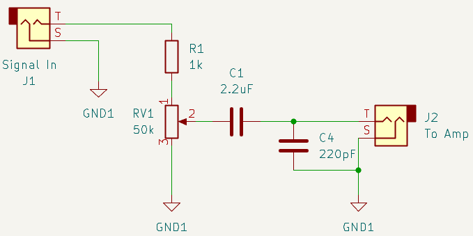
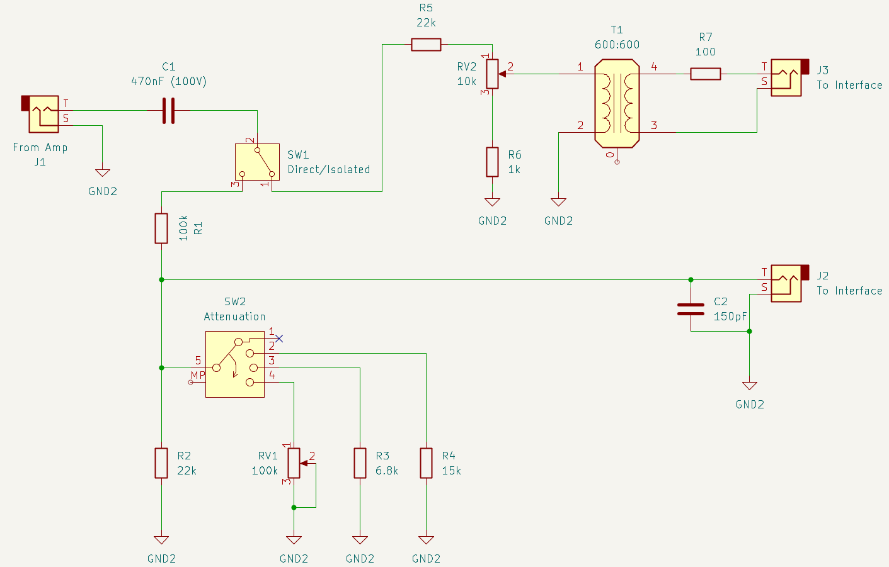
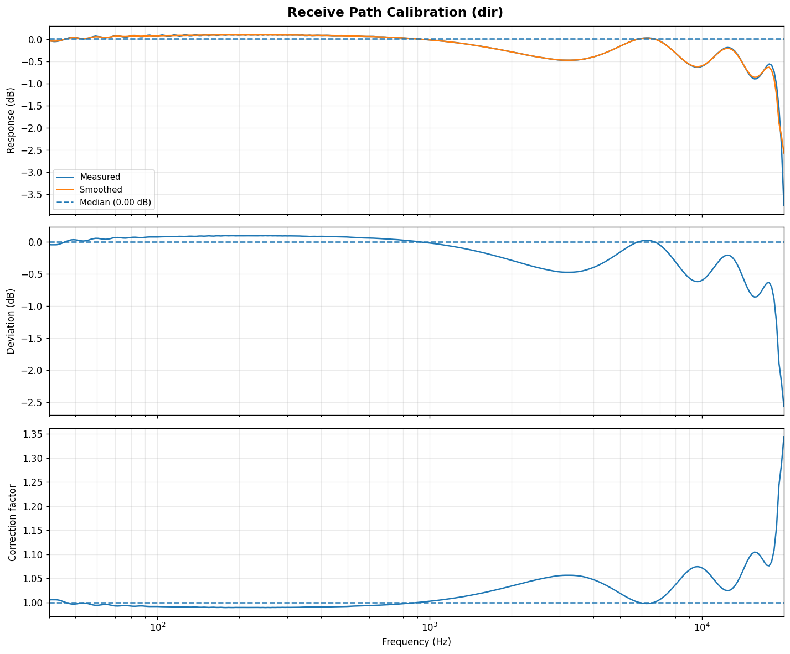
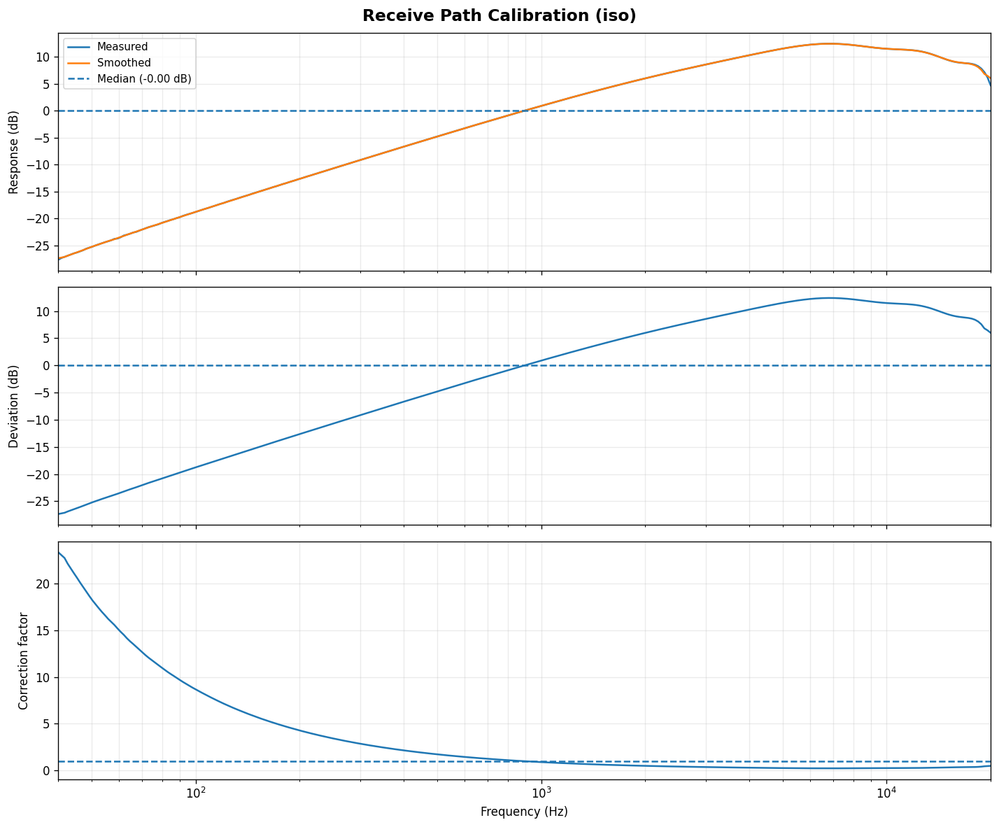

* Table of Contents
{:toc style="float: right;"}

[GitHub Project](https://github.com/mathybit/py-amp-scope){:target="_blank"}

## Introduction

I've been working on a side project this summer to build my own guitar amplifier, because I'm not particularly satisfied with the tone I get from the commercial guitar amps I own.

In my breadboard experiments with various preamplifier circuits, I realized I like the way the tube circuits sound compared to some op-amp and transistor preamps I've tried. The problem is that I'm not completely sure how much of that difference is real, and how much of it is me *wanting* the tube circuit to sound better.

I'm too cheap to buy a commercial tube amp, especially when I know how simple they actually are, plus I don't want to blow out my ear drums just to push the amp to the point where the tubes start to distort the audio. I'm not a fan of conventional tube amplifier designs, not only because I don't want to deal with several hundred volts DC, but I also want to avoid the absurd prices of the transformers required for a traditional design.

I decided to build a hybrid amplifier instead: the preamplifier is where I want to experiment with a mixture of undervolted tubes and other analog signal alterations, while the power section will remain solid state. This will make sure I can get good tone while protecting my hearing.

The current design uses an **LM1875** integrated power amplifier driving the 10-inch Fender speaker from a used **Fender Frontman 25R**. I bought the amp very cheaply particularly for this project. The stock distortion sounds super harsh, so I'm essentially gutting the electronics and repurposing the speaker and cabinet.

That leaves the following questions:
* **How can I quantify what I like/dislike about the sound quality?**
* **How do I objectively compare the preamplifiers?**

Listening is obviously important -- this is a guitar amp, after all -- but the human ear not an objective measurement instrument. A small difference in volume can make one circuit appear to sound better than another, and then there's confirmation bias, which is difficult to avoid.

I needed a repeatable way to characterize what each preamp is actually doing to the signal, so I wrote **[PyAmpScope](https://github.com/mathybit/py-amp-scope){:target="_blank"}**, a Python utility for profiling amplifier frequency response and harmonic distortion using an inexpensive USB audio interface.

## Measurement setup

The basic idea is straightforward:

1. Generate a known audio signal on the computer.
2. Send it through the preamplifier.
3. Capture the output signal.
4. Compare what came back with what was sent and/or with other preamp circuits' outputs.

For the audio interface I'm using a fairly inexpensive [Vantec USB External 7.1 Channel Audio Adapter](https://www.microcenter.com/product/349381/vantec-usb-external-71-channel-audio-adapter){:target="_blank"}. It is not a laboratory-grade measurement device, but it a full-duplex interface, which is what I needed.

The problem is that connecting an experimental amplifier directly to a USB sound card is a good way to accidentally destroy a USB sound card, for several reasons:
* The output of a small preamplifier may only be a few hundred millivolts, but some of the circuits I am experimenting with can produce much larger signals. The power amplifier can obviously produce much more.
* Grounding: connecting the computer ground directly to every experimental circuit can introduce ground loops, and in some setups I needed a way to electrically isolate the audio interface from the amp circuits.

I therefore built a **DI box** between the USB adapter and the amplifier, although its purpose here is somewhat different from a conventional guitar DI: it gives me manual control over the signal going *to* the amplifier, and selectable attenuation/isolation on the signal coming back.

### Send path

The topology is intentionally simple:

|  |
|:--:|
| *Figure 1: DI box send circuitry* |
{:class="table-center" width="50%"}

The send side begins at one channel of the USB adapter's headphone output.

The signal passes through an adjustable voltage divider circuit, which gives me an analog level control independent of the digital level generated by PyAmpScope. A `2.2 µF` coupling capacitor blocks any DC component before the signal reaches the output jack.

I also place a very small capacitor (`220 pF`) directly across the output jack. At audio frequencies its impedance is extremely high, so it has essentially no effect on the guitar-band signal. At radio frequencies its impedance becomes much smaller, giving unwanted RF a short path to ground before it leaves the box.

### Receive path

Here I needed to protect the line input from excessive voltage while giving myself a lot of flexibility regarding attenuation levels, as well as being able to switch between direct coupling and galvanic isolation.

This circuit is not meant to replace proper laboratory instrumentation -- the goal is to prevent me from accidentally destroying my USB interface:

|  |
|:--:|
| *Figure 2: DI box receive circuitry* |
{:class="table-center" width="90%"}

The signal from the amplifier is first AC-coupled through a high-voltage film capacitor, after which it can be routed to either the **direct** or **isolated** measurement path.

The **direct path** is simply a high-impedance resistive attenuator. I was already familiar with the voltage levels coming from the preamps I tried, so I settled on these approximate attenuation levels for the direct connection:

| Switch position | Effective attenuation |
|---|---:|
| Default R1/R2 (`100k / 22k`) | $$\div 5.5$$ |
| R4: `15k` added in parallel | $$\div 12.2$$ |
| R3: `6.8k` added in parallel | $$\div 20.3$$ |
| RV1: `100k` potentiometer | variable |
{:.result-table}

The permanent `22 kΩ` R2 resistor is important. Even if the selector is between positions or a switched resistor becomes disconnected, the interface is not suddenly presented with the full amplifier output. A second small capacitor across the direct output jack provides RF filtering, similar to the send side.

When I don't want the USB interface ground tied directly to the amplifier, I can select the **isolated path**. This uses its own resistive divider to reduce the signal *before* it reaches a `600:600 Ω` EI14 audio transformer. The transformer is approximately 1:1, so its purpose is isolation rather than voltage conversion. Its secondary is floating with respect to the amplifier side of the box.

The important detail is that the **transformer comes after attenuation**: driving a small audio transformer directly from a power-amplifier output would be a great way to saturate the core and turn the transformer itself into the distortion source I am supposedly trying to measure.

## Calibration

Before measuring an amplifier, there is an obvious problem: the measurement system itself has a frequency response. While the USB ADC/DAC may not be perfectly flat,  the isolation transformer is especially capable of changing the response at low frequencies, so the measured result is really
\$$
\text{measured response} = \text{send path} \times \text{amplifier} \times \text{receive path}
\$$

PyAmpScope has separate calibration utilities for the send and receive sides, which save per-frequency correction factors. **Correction is optional and disabled by default**, as my experiments show that the direct path is sufficiently flat for getting a good representation of the amplifier response.

The calibration utilities offer the option to:
- Apply send correction before the signal leaves the computer (PyAmpScope can increase that tone by the inverse amount); if that correction would push any generated sample into clipping, the complete sweep is scaled down uniformly. The relative correction between frequencies is preserved, but the utilities ensure **the DAC is not clipped**.
- Apply receive correction during analysis. Direct and isolated receive paths have separate calibration profiles because the transformer makes them very different electrical systems.

The charts below show the difference between the correction factors for the receive path:

|  | |  |
|:--:|:--:|:--:|
| *Figure 3: Direct path receive calibration* | | *Figure 4: Isolated path receive calibration* |
{:class="table-center" width="100%"}

## Sweep profiling

PyAmpScope's sweep test sends one pure sine wave at a time across the audio spectrum. The default configuration uses logarithmically spaced frequencies between `40 Hz` and `20 kHz`, so the lower octaves receive the same relative sampling density as the upper ones.

The generated waveform is really one long sequence:


[silence] [40 Hz tone] [gap] [next tone] [gap] ... [20 kHz tone] [silence]


The code has some timing logic to ensure correct alignment, between the input/output stream, and for each frequency, PyAmpScope analyzes the middle portion of the tone, trimming the beginning and end. This avoids measuring the short fade used to prevent clicks when tones start and stop.

There are two things I care about for each test frequency:

* **how much the preamp changes the level at that frequency**
* **what new harmonic frequencies the preamp creates**

The first gives me the frequency response. The second gives me some information about the character of the distortion.

## The Mathy Bit: Signal level

Digital audio samples in PyAmpScope are floating point values where `1.0` represents full-scale positive output and `-1.0` represents full-scale negative output.

I define **Tone Amplitude** as the peak value of the generated sine. If the GUI has


Tone Amplitude = 0.5
Send Gain      = 80%


then the requested peak amplitude is
\$$
A_{\text{peak}} = 0.5 \cdot 0.8 = 0.4
\$$

For a sine wave, RMS is related to peak amplitude by
\$$
A_{\text{RMS}} = \dfrac{A_{\text{peak}}}{\sqrt{2}}
\$$

so in this example
\$$
A_{\text{RMS}} = \dfrac{0.4}{\sqrt{2}} \approx 0.2828
\$$

RMS is useful because it gives one consistent measure of signal magnitude. It also maps naturally to `dBFS` (*decibels relative to full scale*):
\$$
L_{\text{dBFS}} = 20\log_{10}(A_{\text{RMS}})
\$$

giving
\$$
20\log_{10}(0.2828) \approx -10.97 \text{ dBFS}
\$$

Note that that **dBFS is not a physical voltage**. It describes the digital sample level relative to the maximum representable digital signal. The physical volume knob on the USB adapter can change the analog voltage independent of the samples generated by Python.

This is why I keep the absolute received RMS/dBFS measurements, but do not use them directly as the main measure of *tone*. A preamp with a gain of 10 should not appear to have a radically different frequency response from an otherwise (spectrally) identical preamp with a gain of 2.

## The Mathy Bit: Frequency response

Suppose a sine tone with frequency $$f$$ is sent with RMS amplitude $$A_S(f)$$ and comes back from the amplifier with fundamental RMS amplitude $$A_R(f)$$. The raw transfer gain $$G$$ at that frequency is
\$$
G(f) = 20\log_{10}\left(\dfrac{A_R(f)}{A_S(f)}\right)
\$$

which by itself primarily captures the overall gain of the circuit. For example, imagine every frequency is attenuated by exactly a factor of `0.2`. A tone sent at amplitude `0.5` comes back at `0.1`, but its spectral shape has not changed at all:
\$$
20\log_{10}\left(\dfrac{0.1}{0.5}\right)
\approx -13.98\text{ dB}
\$$

If that same `-13.98 dB` occurs at *every* frequency, the preamp is spectrally flat. We therefore subtract the median transfer level across the sweep:
\$$
G_{\text{relative}}(f)
=
G(f)
-
\{G_{\text{median}}(f)\}
\$$

The result is a frequency-response curve centered around `0 dB`. With this approach:
- A perfectly flat amplifier becomes a horizontal line regardless of whether its overall gain is `0.2`, `2`, or `20`.
- A bass frequency that is 3 dB stronger than the rest of the response appears at approximately `+3 dB`.
- A high frequency that is 4 dB weaker appears at `-4 dB`.

This is the approach I find most useful for comparing preamplifiers because it separates **overall amplifier gain** volume from **tonal coloration**.

## The Mathy Bit: Harmonics

Measuring the fundamental frequency is only half the story. An ideal linear amplifier receiving a 400 Hz sine would return a 400 Hz sine and nothing else, but a real circuit can also create energy at integer multiples of that frequency:
\$$
400,\;800,\;1200,\;1600,\ldots
\$$

The added components are the harmonics $$H_2, H_3, H_4,\ldots$$.

Instead of simply reading FFT bins, PyAmpScope *fits the captured signal directly to sine and cosine components at the known fundamental and harmonic frequencies*.

For a single component $$x(t)$$ at frequency $$f$$,
\$$
x(t) \approx a\sin(2\pi ft) + b\cos(2\pi ft)
\$$

and the **fitted peak amplitude** is
\$$
A = \sqrt{a^2+b^2}
\$$

so the **RMS amplitude** of that component is
\$$
A_{\text{RMS}} = \dfrac{\sqrt{a^2+b^2}}{\sqrt{2}}
\$$

In practice the fit is done jointly for the fundamental and all observable harmonics up to the configured limit (currently the 10th harmonic, or the Nyquist frequency -- whichever comes first).

This approach has advantages over looking at a single FFT bin:
- it avoid the leakage problem you'd get when a segment doesn't contain an exact integer number of cycles
- the phase of the captured waveform does not need to be known.

Once the harmonic amplitudes are available, **total harmonic distortion** for a tone is given by
\$$
\mathrm{THD}(f)
=
100\sqrt{
\sum_{i=2}^{N}
\left(
\dfrac{A_i}{A_1}
\right)^2
}
\$$

where $$A_1$$ is the RMS amplitude of the fundamental $$H_1$$, and $$A_i$$ is the RMS amplitude of harmonic $$H_i$$.

We can also separate the harmonic energy into even and odd groups:
\$$
H_{\text{even}} = 100\sqrt{
\sum_{i=2,4,6,\ldots}
\left(
\dfrac{A_i}{A_1}
\right)^2
}
\$$
\$$
H_{\text{odd}} = 100\sqrt{
\sum_{i=3,5,7,\ldots}
\left(
\dfrac{A_i}{A_1}
\right)^2
}
\$$

and use their ratio
\$$
\dfrac{H_{\text{even}}}{H_{\text{odd}}}
\$$

as a very useful metric for characterizing the amplifier (the motivation behind this ratio is that guitarists and audiophiles generally say that even harmonics sound more pleasing to the ear, while odd harmonics have a harsher sound).

This is especially useful for comparing tube and solid state amplifiers. While different circuit types might have similar overall THD, they might be distributing that distortion very differently across $$H_\text{even}$$ and $$H_\text{odd}$$. I don't want to assume in advance that one particular harmonic pattern necessarily *sounds better*, but at least I can quantify the difference before listening.

## Frequency bands

Looking at 200+ individual frequencies is useful in a plot, but not particularly convenient for comparing multiple circuits numerically. PyAmpScope groups the tone measurements into conventional audio bands (I haven't found a generally agreed upon definition of these bands, but this is what Google Gemini came up with):

| Band | Frequency range | Characteristic / sonic impact
|---|---:|
| Sub-bass | 20 - 60 Hz | Felt more than heard; provides deep rumble, power (club-shaking energy) |
| Bass | 60 - 250 Hz | Defines the actual pitch & body of bass instruments; adds warmth & punch |
| Low-mid | 250 - 500 Hz | The "mud" or "body" region; covers fundamentals for many instruments |
| Mid | 500 - 2000 Hz | The most critical zone for human hearing; defines the core character, telephone-like qualities, and "honk" of instruments |
| Upper-mid | 2 - 4 kHz | Crucial for the attack and crunch of guitars, the snap of a snare, and vocal articulation; can sound "tinny" if boosted too much |
| Presence | 4 - 6 kHz | Responsible for the clarity, definition, and proximity of vocals and solo instruments; makes sounds feel "in your face" |
| Brilliance | 6 - 20 kHz | The "air," shimmer, and sparkle; accentuates acoustic guitar strings and breaths in a vocal |
{:.result-table}

PyAmpScope analyzes each tone individually first, then groups the resulting values by band, reporting average metrics for each band.

The received level for a band is computed from the mean power of the $$N$$ tones in that band:
\$$
A_{\text{band}} = \sqrt{
\dfrac{1}{N}
\sum_{i=1}^{N}
A_i^2
}
\$$

while the relative frequency response and THD values are summarized across the individual tones.

The important part is the order of operations: **THD is never calculated from the complete concatenated sweep**. Distortion only makes sense relative to the fundamental being played at that moment, so **each tone gets its own harmonic analysis first**. The reported overall and per-band THD values are the average of the corresponding per-tone THD measurements.

This yields a detailed frequency-by-frequency profile and a smaller set of numbers that should make side-by-side preamp comparisons much easier.

## What PyAmpScope measures

At the end of a sweep we have several different views of the same circuit:

* absolute received level in RMS / dBFS
* normalized frequency response in dB
* individual harmonic amplitudes
* THD for every valid test tone
* even/odd harmonic balance
* the same measurements summarized by audio frequency band

These measurements do not tell me whether an amplifier sounds *good* (I don't think there is a formula that can do that), but they can help me identify connections between "amplifiers I like" and their measured tonal characteristics. In other words, I now have a way to separate two questions that are easy to confuse when listening:

1. **Do these circuits actually behave differently?**
2. **If they do, which measurable differences correspond to what I hear?**

That is the part I'm most interested in, because ultimately it will allow me to also answer: **What measurements correspond to what I consistently like to hear?**

## Next steps

I built PyAmpScope because I needed a tool for another project.

The amplifier itself is still a work in progress (I have the LM1875 power stage finished, because I needed to hear what things sound like on the actual speaker I'll be using in the final build). I have several preamp ideas built on breadboards -- tube stages, transistor stages, JFET designs, and op-amp circuits. I'm also experimenting with optical signal transmission (e.g. vactrols) to see what that sounds like.

In a follow-up article I will use PyAmpScope to compare some of these preamps side by side, and see whether the differences I think I hear have anything measurable behind them.
